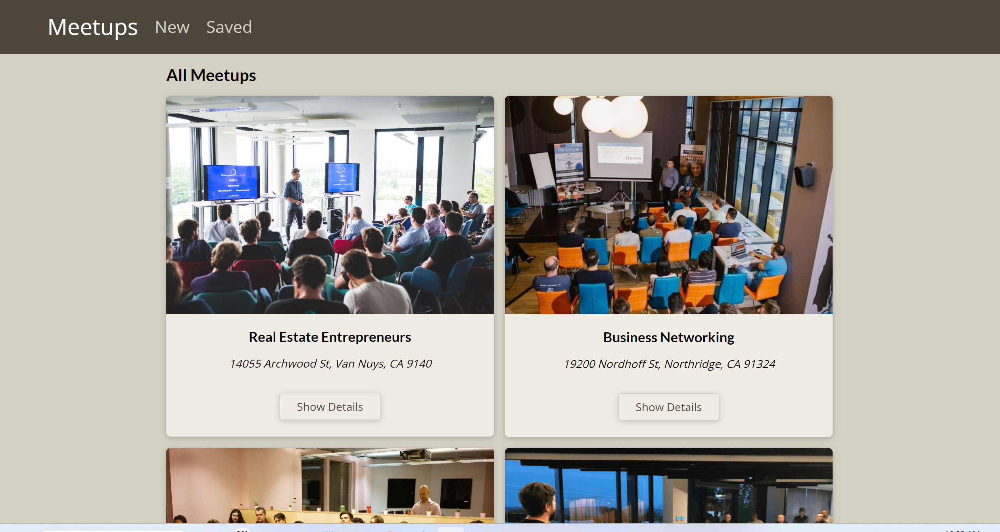
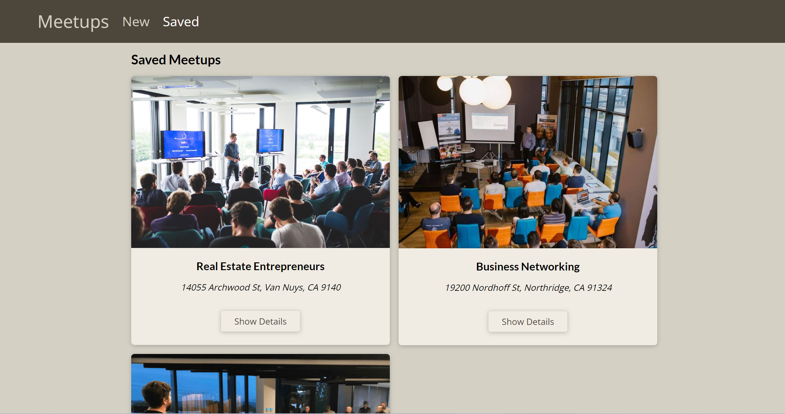

# Meetups

## Description
This is a meetups website where the user can create, update or save a meetup which will be saved in the mongodb. 

## Technologies Used
- HTML
- CSS
- JavaScript (ES6)
- Next.js
- Mongodb

## Usage
Use the navbar buttons to navigate between the pages. Click on the 'Show Details' button to go to the meetup details page. Use the buttons to delete, update, and save the meetup.

### Go to [Meetups](https://meetups-phi-one.vercel.app/)

All meetups

Saved meetups

Meetup details

New meetup

## Questions
### Use the links below if you have any questions.
- Email Address - [armanbarseghyan83@gmail.com](mailto:armanbarseghyan83@gmail.com)
- Linkedin - [https://www.linkedin.com/in/arman-barseghyan](https://www.linkedin.com/in/arman-barseghyan)
- GitHub Profile - [https://github.com/ArmanBarseghyan83](https://github.com/ArmanBarseghyan83)
